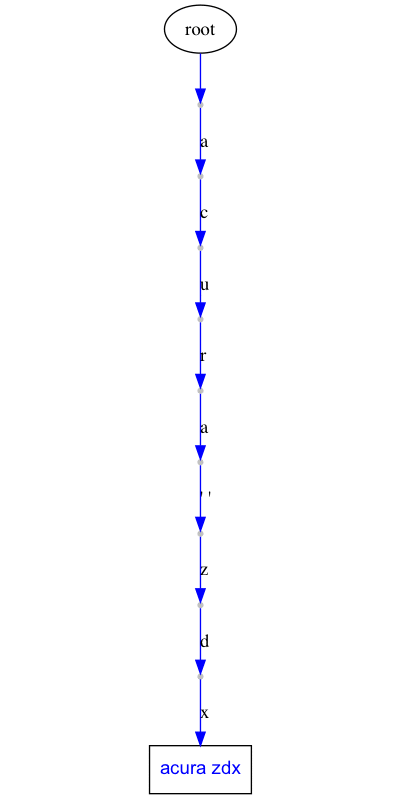
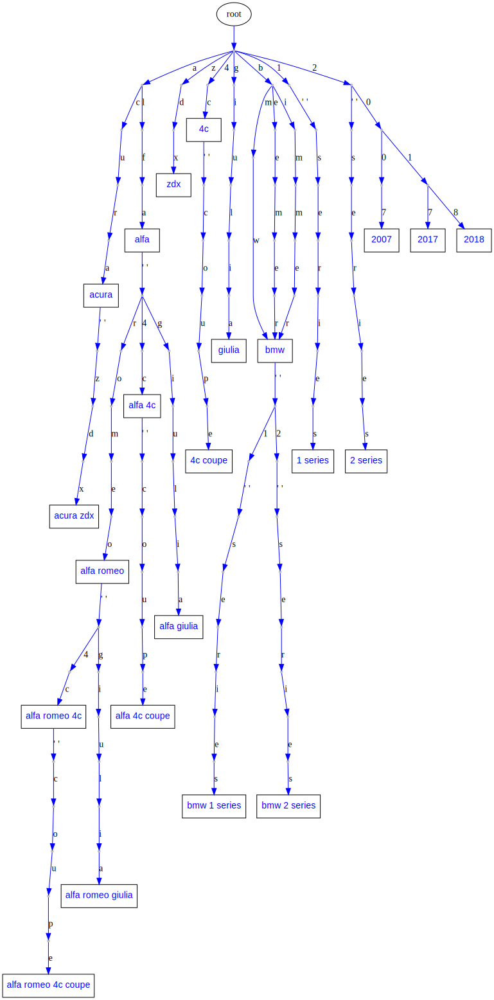

# Fast Autocomplete 0.2.1

Fast autocomplete using Directed Word Graph (DWG) and Levenshtein Edit Distance.

The results are cached via LFU (Least Frequently Used).

# Why

This library was written when we came to the conclusion that Elasticsearch's Autocomplete suggestor is not fast enough and doesn't do everything that we need:

1. Once we switched to Fast Autocomplete, our average latency went from 120ms to 30ms so an improvement of 3-4x in performance and errors went down to zero.
2. Elasticsearch's Autocomplete suggestor does not handle any sort of combination of the words you have put in. For example Fast Autocomplete can handle `2018 Toyota Camry in Los Angeles` when the words `2018`, `Toyota Camry`, `Los Angeles` are seperately fed into it. While Elasticsearch's autocomplete needs that whole sentence to be fed to it to show it in Autocomplete results.

You might say:

1. Regarding #1: Yes, but you are using caching. Answer: shhh Yes, keep it quiet. We are also doing Levenshtein Edit distance using a C library so it improves there too.
2. Regarding #2: I'm speechless. Answer: Ok, now we are talking.


# How

In a nutshell, what the fast Autocomplete does is:

1. Populate the DWG with your words.
2. Follow the graph nodes letter by letter until it finds nodes that have words in them.
3. Continue after words are found on the graph until it reaches the leaf node.
4. Restart from the root node again until it reaches a letter that doesn't exist on the graph.
5. Depending on how much is left from the rest of the word, return all the descendant words from where it got stuck
6. Or run Levenshtein edit distance to find closes words to what is left and the continue from there.

By doing so, it can tokenize a text such as:

`2018 Toyota Camry in Los Angeles` into [`2018`, `toyota camry`, `in`, `los angeles`]

And return Autocomplete results as you type.

# Install

`pip install fast-autocomplete`

**Note: Fast Autocomplete only works with Python 3.6 and newer.**

Are you still on Python 2? TIME TO UPGRADE.

# Licence

MIT

# DWG

The data structure we use in this library is called Dawg.

DWG stands for Directed Word Graph. Here is an example DWG based on the "makes_models_short.csv" that is provided in the tests:






# Usage

First of all lets start from your data. The library leaves it up to you how to prepare your data.
Imagine that we have a csv with the following content from vehicles' make and models:

```csv
make,model
acura,zdx
alfa romeo,4c
alfa romeo,4c coupe
alfa romeo,giulia
bmw,1 series
bmw,2 series
2007,2007
2017,2017
2018,2018
```

What we want to do is to convert this to a dictionary of words and their context.


```py
import csv
from fast_autocomplete.misc import read_csv_gen


def get_words(path):

    csv_gen = read_csv_gen(path, csv_func=csv.DictReader)

    words = {}

    for line in csv_gen:
        make = line['make']
        model = line['model']
        if make != model:
            local_words = [model, '{} {}'.format(make, model)]
            while local_words:
                word = local_words.pop()
                if word not in words:
                    words[word] = {}
        if make not in words:
            words[make] = {}
    return words
```

the `read_csv_gen` is just a helper function. You don't really need it. The whole point is that we are converting that csv to a dictionary that looks like this:

```py
>>> words = get_words('path to the csv')
>>> words
{'acura zdx': {},
 'zdx': {},
 'acura': {},
 'alfa romeo 4c': {},
 '4c': {},
 'alfa romeo': {},
 'alfa romeo 4c coupe': {},
 '4c coupe': {},
 'alfa romeo giulia': {},
 'giulia': {},
 'bmw 1 series': {},
 '1 series': {},
 'bmw': {},
 'bmw 2 series': {},
 '2 series': {},
 '2007': {},
 '2017': {},
 '2018': {}}
```

This is a dictionary of words to their context. We have decided that we don't want any context for the words in this example so all the contexts are empty. However generally you will want some context around the words for more complicated logics. The context is used to convert the words "keys" into their context which is the value of the key in the words dictionary.

In addition to words, we usually want a dictionary of synonyms. Something like this:

```py
synonyms = {
    "alfa romeo": ["alfa"],
    "bmw": ["beemer", "bimmer"],
    "mercedes-benz": ["mercedes", "benz"],
    "volkswagen": ["vw"]
}
```

Note that synonyms are optional. Maybe in your use case you don't need synonyms.

Now we can use the above to initialize Autocomplete

```py

from fast_autocomplete import AutoComplete

autocomplete = AutoComplete(words=words, synonyms=synonyms)
```

At this point, AutoComplete has created a [dwg](#DWG) structure.

Now you can search!

- word: the word to return autocomplete results for
- max_cost: Maximum Levenshtein edit distance to be considered when calculating results
- size: The max number of results to return

```py
>>> autocomplete.search(word='2018 bmw 1', max_cost=3, size=3)
[['2018', 'bmw'], ['2018', 'bmw 1 series']]
```

Now what if we pressed a by mistake then? It still works. No problem.

```py
>>> autocomplete.search(word='2018 bmw 1a', max_cost=3, size=3)
[['2018', 'bmw'], ['2018', 'bmw 1 series']]
```

Ok let's search for Alfa now:

```py
>>> autocomplete.search(word='alfa', max_cost=3, size=3)
[['alfa romeo'], ['alfa romeo 4c'], ['alfa romeo giulia']]
```

What if we don't know how to pronounce alfa and we type `alpha` ?

```py
>>> autocomplete.search(word='alpha', max_cost=3, size=3)
[['alfa romeo'], ['alfa romeo 4c'], ['alfa romeo giulia']]
```

It still works!

Fast-Autocomplete makes sure the results make sense!

Ok lets add the word `Los Angeles` there to the words:


```py
>>> words['los angeles'] = {}
>>> words['in'] = {}
>>> autocomplete.search(word='2007 alfa in los', max_cost=3, size=3)
[['2007', 'alfa romeo', 'in'], ['2007', 'alfa romeo', 'in', 'los angeles']]
```

So far we have not used the context. And this library leaves it up to you how to use the context. But basically if we giving a context to each one of those words, then the above response could easly be translated to the list of those contexts.

## context

If our words dictionary was:

```py
words = {
 'in': {},
 'alfa romeo': {'type': 'make'},
 '2007': {'type': 'year'},
 'los angeles': {'type': 'location'},
}
```

Then the `autocomplete.words` can be used to map the results into their context:

```
[['2007', 'alfa romeo', 'in'], ['2007', 'alfa romeo', 'in', 'los angeles']]

converted to contexts:

[[{'year': '2007'}, {'make': alfa romeo'}], [{'year': '2007'}, {'make': alfa romeo'}, {'location': 'los angeles'}]]
```


## Draw

This package can actually draw the dwgs as it is populating them or just once the dwg is populated for you!
Here is the animation of populating the dwg with words from "makes_models_short.csv":


### Draw animation of dwg populating

```py
from fast_autocomplete import AutoComplete, DrawGraphMixin


class AutoCompleteDraw(DrawGraphMixin, AutoComplete):
    DRAW_POPULATION_ANIMATION = True
    DRAW_POPULATION_ANIMATION_PATH = 'animation/short_.svg'
    DRAW_POPULATION_ANIMATION_FILENO_PADDING = 6


autocomplete = AutoCompleteDraw(words=words, synonyms=synonyms)
```

As soon as you initialize the above AutoCompleteDraw class, it will populate the dwg and generate the animation!
For an example of this code properly setup, take a look at the tests. In fact the animation in the [dwg](#dwg) section is generated the same way via unit tests!

Note that if you have many words, the graph file will be big. Instead of drawing all frames as the dwg is being populated, you can just draw the final stage:

### Draw the final graph

To draw just one graph that shows the final stage of the dwg, use the draw mixin and run the draw_graph function:

```py
from fast_autocomplete import AutoComplete, DrawGraphMixin


class AutoCompleteDraw(DrawGraphMixin, AutoComplete):
    pass

autocomplete = AutoCompleteDraw(words=words, synonyms=synonyms)
autocomplete.draw_graph('path to file')
```

## Demo

If you want to have a real-time interaction with Autocomplete results in your terminal, you can use the demo module:

Just pass it an instance of the autocomplete and the search configs:

```py
from fast_autocomplete import demo

demo(autocomplete, max_cost=3, size=5)
```

# Develop

1. Clone the repo
2. Make a virtualenv with Python 3.6 or newer
3. `pip install -r requirements-dev.txt`

## Run tests

`pytest`

We try to maintain high standard in code coverage. Currently the `dwg` module's coverage is around 99%!


# Authors

- Autocomplete by [Sep Dehpour](http://zepworks.com) at [Fair Financial Corp](https://fair.com).
- LFU Cache by [Shane Wang](https://medium.com/@epicshane)

# Other ways of doing AutoComplete

1. Elastic search. Yes, Elasticsearch generally is a *better* Autocomplete solution than this library. I said generally. In our specific use case, we wanted Autocomplete to be faster than Elasticsearch and handle combination of words. Otherwise Elasticsearch would have been perfect. Behind the scene Elasticsearch uses Finite State Transducer (FST) in Lucene to achive AutoComplete. FST is more complicated than what we have used in fast-autocomplete.

2. If your autocomplete is supposed to return results based on a big blog of text (for example based on some book contents), then a better solution is to go with Markov chains and conditional probability. Yes, there is already a library out there for it! <https://github.com/rodricios/autocomplete> and it looks great. Disclaimer: we have not actually used it since it doesn't fit our specific use-case.


# FAQ

## Why DWG
DWG stands for Directed Word Graph. Originally we were using Trie-Tree structure. But soon it was obvious that some branches needed to  merge back to other branches. Such as `beemer` and `bmw` branches both need to end in the same node since they are synonyms. Thus we used DWG.

## What are synonyms, clean synonyms and partial synonyms
Synonyms are words that should produce the same results.

- For example `beemer` and `bmw` should both give you `bmw`.
- `alfa` and `alfa romeo` should both give you `alfa romeo`

The synonyms get divided into 2 groups:

1. clean synonyms: The 2 words share little or no words. For example `beemer` vs. `bmw`.
2. partial synonyms: One of the 2 words is a substring of the other one. For example `alfa` and `alfa romeo` or `gm` vs. `gmc`.

Internally these 2 types of synonyms are treated differently but as a user of the library, you don't need to really care about it. You just provide the synonyms dictionary via defining the `get_synonyms` method.

## Why do you have a whole subtree for partial synonyms
Q: Partial synonym means the synonym is a part of the original word. Such as `alfa` is a partial synonym for `alfa romeo`.
In that case you are inserting both `alfa` and `alfa romeo` in the dwg. `alfa` will have `alfa 4c` and `alpha romeo` will have `alfa romeo 4c` branches. Why not just have `alfa` branches to be `alfa romeo` and from there you will have automatically all the sub branches of `alfa romeo`.

Answer: We use letters for edges. So `alfa` can have only one edge coming out of it that is space (` `). And that edge is going to a node that has sub-branches to `alfa romoe`, `alfa 4c` etc. It can't have a ` ` going to that node and another ` ` going to `alfa romeo`'s immediate child. That way when we are traversing the dwg for the input of `alfa 4` we get to the correct node.

## I put Toyota in the Dawg but when I type `toy`, it doesn't show up.

Answer: If you put `Toyota` with capital T in the dwg, it expects the search word to start with capital T too. We suggest that you lower case everything before putting them in dwg. Fast-autocomplete does not automatically do that for you since it assumes the `words` dictionary is what you want to be put in the dwg. It is up to you to clean your own data before putting it in the dwg.
